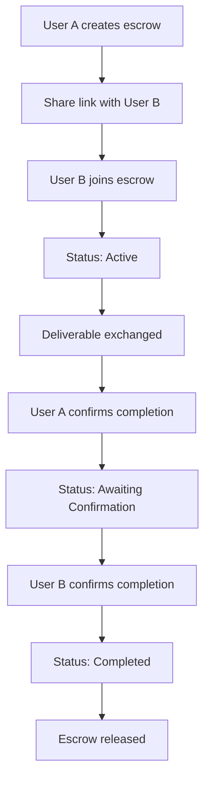
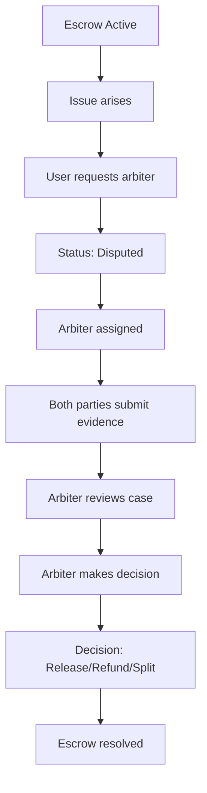
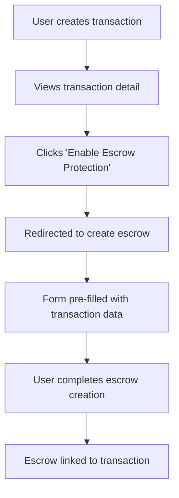

# Escrow Feature Documentation

## Overview

The Escrow feature provides secure, third-party mediated transactions for Sabot users. It ensures that deliverables (cash, items, services, documents, or digital goods) are held securely until both parties confirm completion, with optional arbiter intervention for disputes.

## Table of Contents

- [Features](#features)
- [Architecture](#architecture)
- [Database Schema](#database-schema)
- [API Endpoints](#api-endpoints)
- [UI Components](#ui-components)
- [User Flows](#user-flows)
- [Integration Guide](#integration-guide)
- [Future Enhancements](#future-enhancements)

---

## Features

### Core Functionality

- ✅ **Escrow Creation**: Users can create escrow-protected transactions with detailed terms
- ✅ **Multiple Deliverable Types**: Support for cash, items, services, digital goods, documents, and mixed
- ✅ **Status Tracking**: Real-time status updates (pending, active, awaiting_confirmation, completed, disputed, etc.)
- ✅ **Dual Confirmation**: Both parties must confirm completion before escrow is released
- ✅ **Arbiter System**: Request independent arbiter for dispute resolution
- ✅ **Event Timeline**: Immutable log of all escrow events
- ✅ **Verification Requirements**: Optional identity verification for participants
- ✅ **Evidence Upload**: Upload supporting documents for disputes (future: fully implemented in v2)

### User Experience

- 🎨 Responsive design with mobile-first approach
- 🌗 Dark mode support
- ♿ Accessible UI following WCAG guidelines
- 📱 Progressive Web App ready
- 🔔 Real-time updates (ready for WebSocket integration)

---

## Architecture

### Tech Stack

- **Frontend**: Next.js 14+ (App Router), React, TypeScript
- **Styling**: Tailwind CSS, Shadcn UI components
- **Database**: Supabase (PostgreSQL)
- **Authentication**: Supabase Auth
- **State Management**: React hooks (ready for Zustand if needed)
- **Future**: Blockchain integration (Lisk SDK)

### Directory Structure

```
sabot/
├── src/
│   ├── types/
│   │   └── escrow.ts                    # TypeScript types and interfaces
│   ├── app/
│   │   ├── api/escrow/                  # API routes
│   │   │   ├── create/route.ts          # POST - Create escrow
│   │   │   ├── join/route.ts            # POST - Join escrow
│   │   │   ├── confirm/route.ts         # POST - Confirm completion
│   │   │   ├── request-arbiter/route.ts # POST - Request arbiter
│   │   │   └── [id]/
│   │   │       └── status/route.ts      # GET - Fetch escrow status
│   │   └── escrow/                      # Pages
│   │       ├── new/page.tsx             # Create new escrow
│   │       └── [id]/page.tsx            # View escrow details
│   └── components/
│       └── escrow/                      # UI components
│           ├── escrow-status-badge.tsx
│           ├── escrow-details-card.tsx
│           ├── escrow-timeline.tsx
│           ├── confirm-completion-modal.tsx
│           ├── request-arbiter-modal.tsx
│           ├── create-escrow-form.tsx
│           └── enable-escrow-button.tsx
└── supabase/
    └── migrations/
        └── 008_create_escrow_tables.sql # Database schema
```

---

## Database Schema

### Tables

#### `escrows`

Main table storing escrow transaction details.

**Key Fields**:

- `id` (UUID): Primary key
- `type`: Escrow type (cash, item, service, digital, document, mixed)
- `status`: Current status (pending, active, awaiting_confirmation, completed, disputed, etc.)
- `initiator_id`: User who created the escrow
- `participant_id`: User who joined the escrow
- `title`: Escrow title
- `deliverable_description`: What needs to be delivered
- `amount`: Optional transaction amount
- `initiator_confirmation`: Confirmation status (pending, confirmed, disputed)
- `participant_confirmation`: Confirmation status (pending, confirmed, disputed)
- `arbiter_requested`: Boolean flag
- `arbiter_id`: Assigned arbiter (if any)
- `verification_required`: Whether identity verification is required
- `blockchain_tx_id`: For future blockchain integration

#### `escrow_events`

Timeline of all events for each escrow.

**Key Fields**:

- `id` (UUID): Primary key
- `escrow_id`: Reference to escrow
- `event_type`: Type of event (created, participant_joined, initiator_confirmed, etc.)
- `actor_id`: User who triggered the event
- `details`: JSONB field for additional data
- `timestamp`: When the event occurred

#### `escrow_evidence`

Supporting documents and evidence for disputes.

**Key Fields**:

- `id` (UUID): Primary key
- `escrow_id`: Reference to escrow
- `uploaded_by`: User who uploaded
- `file_path`: Storage path
- `description`: Evidence description

### Row Level Security (RLS)

All tables have RLS enabled with policies ensuring:

- Users can only view escrows they're involved in
- Only authorized parties can update escrow status
- Event creation is restricted to involved parties
- Evidence is only visible to escrow participants and arbiters

---

## API Endpoints

### POST `/api/escrow/create`

Creates a new escrow transaction.

**Request Body**:

```typescript
{
  type: 'cash' | 'item' | 'service' | 'digital' | 'document' | 'mixed',
  title: string,
  description?: string,
  deliverable_description: string,
  amount?: number,
  currency?: string,
  expected_completion_date?: string,
  verification_required?: boolean,
  transaction_id?: string,
  agreement_id?: string,
  participant_email?: string
}
```

**Response** (201):

```typescript
{
  success: true,
  escrow: Escrow,
  message: string
}
```

### POST `/api/escrow/join`

Join an existing escrow as a participant.

**Request Body**:

```typescript
{
  escrow_id: string;
}
```

### POST `/api/escrow/confirm`

Confirm completion of escrow deliverable.

**Request Body**:

```typescript
{
  escrow_id: string,
  confirmation_notes?: string
}
```

**Behavior**:

- First confirmation: Status changes to `awaiting_confirmation`
- Second confirmation: Status changes to `completed`

### POST `/api/escrow/request-arbiter`

Request arbiter intervention for dispute.

**Request Body**:

```typescript
{
  escrow_id: string,
  dispute_reason: string,
  dispute_details: string,
  evidence_urls?: string[]
}
```

### GET `/api/escrow/[id]/status`

Fetch comprehensive escrow status.

**Response**:

```typescript
{
  escrow: EscrowWithParticipants,
  events: EscrowEvent[],
  current_user_role?: 'initiator' | 'participant',
  can_confirm: boolean,
  can_dispute: boolean,
  can_cancel: boolean
}
```

---

## UI Components

### `<EscrowStatusBadge>`

Displays colored badge with icon for escrow status.

**Props**:

- `status`: EscrowStatus
- `size?`: 'sm' | 'md' | 'lg'

### `<EscrowDetailsCard>`

Comprehensive card showing all escrow information.

**Props**:

- `escrow`: EscrowWithParticipants
- `currentUserRole?`: 'initiator' | 'participant'

**Features**:

- Transaction details (amount, deliverable)
- Party information with verification badges
- Confirmation status indicators
- Arbiter information (if applicable)
- Timeline information

### `<EscrowTimeline>`

Chronological display of escrow events.

**Props**:

- `events`: EscrowEvent[]

### `<ConfirmCompletionModal>`

Modal for confirming escrow completion.

**Props**:

- `open`: boolean
- `onOpenChange`: (open: boolean) => void
- `onConfirm`: (notes?: string) => Promise<void>
- `escrowTitle`: string
- `isOtherPartyConfirmed`: boolean

### `<RequestArbiterModal>`

Modal for requesting arbiter intervention.

**Props**:

- `open`: boolean
- `onOpenChange`: (open: boolean) => void
- `onRequest`: (reason: string, details: string) => Promise<void>
- `escrowTitle`: string

### `<CreateEscrowForm>`

Complete form for creating new escrow.

**Features**:

- Type selection
- Amount and currency inputs
- Deliverable description
- Expected completion date
- Verification requirement toggle
- Participant invitation

### `<EnableEscrowButton>`

Button to enable escrow protection for transactions/agreements.

**Props**:

- `transactionId?`: string
- `agreementId?`: string
- `variant?`: Button variant
- `size?`: Button size

---

## User Flows

### Flow 1: Create and Complete Escrow



### Flow 2: Dispute Resolution



### Flow 3: Link to Transaction



---

## Integration Guide

### Adding Escrow to Your Page

#### Option 1: Direct Link

```tsx
import { Button } from '@/components/ui/button';
import { Shield } from 'lucide-react';
import { ROUTES } from '@/constants/routes';
import Link from 'next/link';

<Button asChild>
  <Link href={ROUTES.ESCROW.NEW}>
    <Shield className="mr-2 h-4 w-4" />
    Create Escrow
  </Link>
</Button>;
```

#### Option 2: Enable Escrow Button

```tsx
import { EnableEscrowButton } from '@/components/escrow/enable-escrow-button';

// For a transaction
<EnableEscrowButton transactionId={transaction.id} />

// For an agreement
<EnableEscrowButton agreementId={agreement.id} />

// Standalone
<EnableEscrowButton />
```

### Using Escrow Components

```tsx
import { EscrowDetailsCard } from '@/components/escrow/escrow-details-card';
import { EscrowTimeline } from '@/components/escrow/escrow-timeline';
import { EscrowStatusBadge } from '@/components/escrow/escrow-status-badge';

function MyEscrowPage({ escrow, events, currentUserRole }) {
  return (
    <div>
      <EscrowStatusBadge status={escrow.status} />
      <EscrowDetailsCard escrow={escrow} currentUserRole={currentUserRole} />
      <EscrowTimeline events={events} />
    </div>
  );
}
```

### Fetching Escrow Data

```typescript
async function fetchEscrow(id: string) {
  const response = await fetch(`/api/escrow/${id}/status`);
  const data = await response.json();

  return {
    escrow: data.escrow,
    events: data.events,
    userRole: data.current_user_role,
    permissions: {
      canConfirm: data.can_confirm,
      canDispute: data.can_dispute,
      canCancel: data.can_cancel,
    },
  };
}
```

---

## Future Enhancements

### Phase 2: Enhanced Features

- [ ] **Blockchain Integration**: Record escrow events on blockchain (Lisk SDK)
- [ ] **Smart Contract Execution**: Automated release based on blockchain conditions
- [ ] **Real-time Updates**: WebSocket integration for live status updates
- [ ] **Multi-party Escrows**: Support for more than 2 participants
- [ ] **Partial Release**: Release escrow in stages/milestones
- [ ] **Escrow Templates**: Pre-defined templates for common scenarios
- [ ] **Recurring Escrows**: Automated escrow creation for recurring services

### Phase 3: Advanced Features

- [ ] **Insurance Integration**: Optional insurance for high-value escrows
- [ ] **Cryptocurrency Support**: Accept crypto payments
- [ ] **International Support**: Multi-currency and localization
- [ ] **API for Third Parties**: Public API for external integrations
- [ ] **Mobile App**: Native mobile application
- [ ] **AI Risk Assessment**: Automated risk scoring for escrows
- [ ] **Escrow Marketplace**: Public listing of escrow services

### Phase 4: Enterprise Features

- [ ] **White Label Solution**: Customizable escrow for businesses
- [ ] **Bulk Escrow Management**: Handle multiple escrows at scale
- [ ] **Advanced Analytics**: Detailed insights and reporting
- [ ] **Custom Workflows**: Configurable approval chains
- [ ] **SLA Guarantees**: Guaranteed processing times
- [ ] **Dedicated Support**: Priority support for enterprise clients

---

## Security Considerations

### Current Implementation

1. **Authentication**: All endpoints require Supabase authentication
2. **Authorization**: RLS policies ensure users can only access their escrows
3. **Input Validation**: All inputs validated before processing
4. **SQL Injection Protection**: Supabase client handles parameterized queries
5. **XSS Protection**: React automatically escapes rendered content

### Recommendations

1. **Rate Limiting**: Implement rate limiting on API endpoints
2. **Audit Logging**: Log all sensitive operations
3. **Encryption**: Encrypt sensitive data at rest
4. **2FA**: Require 2FA for high-value escrows
5. **KYC/AML**: Implement Know Your Customer for large amounts
6. **Fraud Detection**: Monitor for suspicious patterns

---

## Testing Guide

### Unit Tests (TODO)

```typescript
// Example test for escrow creation
describe('POST /api/escrow/create', () => {
  it('should create escrow with valid data', async () => {
    const response = await fetch('/api/escrow/create', {
      method: 'POST',
      body: JSON.stringify({
        type: 'item',
        title: 'Test Escrow',
        deliverable_description: 'Test item',
      }),
    });

    expect(response.status).toBe(201);
    const data = await response.json();
    expect(data.success).toBe(true);
    expect(data.escrow).toBeDefined();
  });
});
```

### Integration Tests (TODO)

Test complete user flows from creation to completion.

### E2E Tests (TODO)

Use Playwright or Cypress for end-to-end testing.

---

## Troubleshooting

### Common Issues

**Issue**: "Unauthorized" when creating escrow

- **Solution**: Ensure user is logged in and Supabase session is valid

**Issue**: Cannot join escrow

- **Solution**: Check that escrow is in 'pending' status and doesn't already have a participant

**Issue**: Cannot confirm completion

- **Solution**: Verify escrow is in 'active' or 'awaiting_confirmation' status

**Issue**: Arbiter request fails

- **Solution**: Ensure escrow is in 'active' or 'awaiting_confirmation' status and arbiter hasn't been requested yet

### Debug Mode

Enable debug logging:

```typescript
// In API routes
console.log('Escrow operation:', { escrowId, userId, action });
```

---

## Support and Contribution

### Getting Help

- Check this documentation first
- Review the [Contributing Guide](./contributing.md)
- Open an issue on GitHub
- Contact: support@sabot.app

### Contributing

We welcome contributions! Please see [CONTRIBUTING.md](./contributing.md) for guidelines.

**Areas for contribution**:

- Bug fixes
- Feature enhancements
- Documentation improvements
- Test coverage
- Performance optimizations

---

## License

This feature is part of the Sabot platform. See main LICENSE file for details.

---

## Changelog

### v1.0.0 (2025-10-21)

- ✨ Initial escrow feature implementation
- 📊 Database schema and migrations
- 🎨 Complete UI component library
- 🔌 REST API endpoints
- 📱 Responsive and accessible design
- 📚 Comprehensive documentation

---

**Last Updated**: October 21, 2025
**Version**: 1.0.0
**Maintainer**: Sabot Development Team
