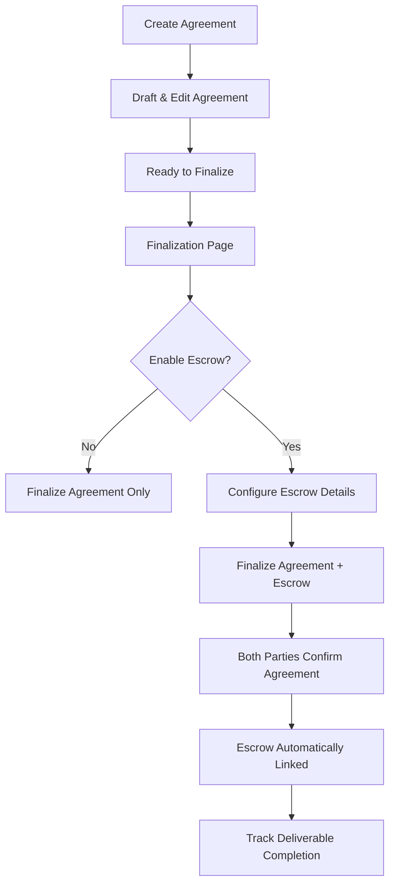

# Escrow Feature - Refactored Architecture

## Overview

The Escrow feature has been **refactored** to be an optional add-on during agreement finalization, rather than a standalone feature. This provides a more natural and integrated user experience.

## Key Changes

### Previous Architecture ❌

- Escrow was a **separate, standalone** feature
- Users created escrows independently from agreements
- Escrow had its own pages (`/escrow/new`, `/escrow/[id]`)
- Users had to link escrow to agreements manually

### New Architecture ✅

- Escrow is an **optional add-on** during agreement finalization
- Escrow is created **as part of** finalizing an agreement
- Escrow lives within the agreement flow
- Natural, seamless user experience

---

## User Flow

### Creating an Agreement with Escrow Protection



### Agreement Finalization Page

The finalization page (`/agreement/[id]/finalize`) now includes:

1. **Confirmation Status Card** - Party confirmations
2. **🆕 Escrow Protection Card** - Optional toggle with configuration
3. **Parties Info** - Participant details
4. **Agreement Details** - Terms and summary
5. **Document Structure** - Content outline
6. **AI Suggestions** - Recommendations

---

## Escrow Protection Card

### Features

#### Toggle Switch

- Enable/disable escrow protection
- When disabled: Agreement finalizes normally
- When enabled: Shows escrow configuration options

#### Configuration Options

**Required Fields:**

- **Deliverable Type**: Cash, Item, Service, Digital, Document, Mixed
- **Deliverable Description**: What needs to be completed

**Optional Fields:**

- **Amount & Currency**: Transaction value
- **Expected Completion Date**: When deliverable is due
- **Verification Required**: Toggle for identity verification
- **🆕 Pre-assign Arbiter**: Special escrow version with oversight

#### Arbiter-Based Escrow (Special Version)

When "Pre-assign Arbiter" is enabled:

- **Status starts as**: `arbiter_review` (instead of `pending`)
- **Arbiter is assigned**: From the beginning (not just on dispute)
- **Oversight**: Arbiter monitors the entire escrow lifecycle
- **Use cases**:
  - High-value agreements
  - High-risk transactions
  - Complex deliverables
  - Parties want third-party oversight

---

## Database Schema

### No Changes Required! ✅

The existing escrow tables support this architecture:

- `agreement_id` field links escrow to agreement
- `arbiter_requested` + `arbiter_id` support pre-assigned arbiters
- `status` field includes `arbiter_review` state

### Escrow Statuses

| Status                  | Description                 | When Used                                    |
| ----------------------- | --------------------------- | -------------------------------------------- |
| `pending`               | Waiting for participant     | Agreement finalized, waiting for other party |
| `active`                | Transaction in progress     | Both parties joined                          |
| `arbiter_review`        | 🆕 **Pre-assigned arbiter** | Created with arbiter oversight               |
| `awaiting_confirmation` | One party confirmed         | Waiting for other confirmation               |
| `completed`             | Escrow released             | Both parties confirmed                       |
| `disputed`              | Dispute raised              | Arbiter requested after issue                |
| `cancelled`             | Transaction cancelled       | -                                            |
| `expired`               | Escrow expired              | Exceeded expiration date                     |

---

## API Updates

### POST `/api/escrow/create`

**New Field**:

```typescript
{
  // ... existing fields
  arbiter_required?: boolean  // Pre-assign arbiter (special escrow)
}
```

**Behavior**:

- If `arbiter_required: true` → Status set to `arbiter_review`
- If `arbiter_required: false` → Status set to `pending`
- TODO: Assign actual arbiter from pool in production

---

## Component Architecture

### New Component: `<EscrowProtectionCard>`

**Location**: `src/components/agreement/finalize/escrow-protection-card.tsx`

**Props**:

```typescript
interface EscrowProtectionCardProps {
  enabled: boolean;
  onEnabledChange: (enabled: boolean) => void;
  onEscrowDataChange: (data: EscrowData) => void;
}
```

**Features**:

- Toggle to enable/disable escrow
- Form fields for escrow configuration
- Validation (requires deliverable description)
- Summary display
- Special UI for arbiter-based escrow

### Updated Page: Agreement Finalization

**Location**: `src/app/agreement/[id]/finalize/page.tsx`

**Changes**:

- Added `<EscrowProtectionCard>` component
- State management for escrow data
- Validation before confirmation
- API call to create escrow when confirmed

---

## User Experience

### Standard Agreement (No Escrow)

1. User creates agreement
2. Parties edit and collaborate
3. Navigate to finalization page
4. **Escrow toggle stays OFF**
5. Parties confirm → Agreement finalized
6. No escrow created

### Agreement with Standard Escrow

1. User creates agreement
2. Parties edit and collaborate
3. Navigate to finalization page
4. **Toggle ON: Enable Escrow Protection**
5. Fill escrow details (deliverable, amount, etc.)
6. **Arbiter toggle stays OFF**
7. Parties confirm → Agreement + Escrow created
8. Escrow status: `pending` → `active`
9. Complete deliverable → Parties confirm → `completed`

### Agreement with Arbiter-Based Escrow (Special)

1. User creates agreement
2. Parties edit and collaborate
3. Navigate to finalization page
4. **Toggle ON: Enable Escrow Protection**
5. Fill escrow details
6. **Toggle ON: Pre-assign Arbiter** 🆕
7. Parties confirm → Agreement + Special Escrow created
8. Escrow status: `arbiter_review` (arbiter assigned immediately)
9. Arbiter monitors entire lifecycle
10. Can intervene at any time
11. Complete normally or arbiter resolves issues

---

## Advantages of New Architecture

### For Users ✅

- **Simpler**: One flow instead of two separate features
- **Natural**: Escrow is "part of" agreement, not separate
- **Contextual**: Configure escrow with full agreement context
- **Flexible**: Optional - use only when needed
- **Safer**: Arbiter-based option for high-risk agreements

### For Developers ✅

- **Cleaner**: Less code duplication
- **Maintainable**: Single source of truth
- **Extensible**: Easy to add more agreement-linked features
- **Logical**: Data model matches user mental model

### For Product ✅

- **Reduces confusion**: One fewer concept to explain
- **Increases adoption**: Escrow presented at natural decision point
- **Better UX**: Fewer clicks, smoother flow
- **Premium feature**: Arbiter-based escrow can be monetized

---

## Migration Guide

### For Existing Code

**Before** (Standalone Escrow):

```tsx
// Old way - separate page
import { CreateEscrowForm } from '@/components/escrow/create-escrow-form';

<CreateEscrowForm />;
```

**After** (Agreement Add-on):

```tsx
// New way - part of finalization
import { EscrowProtectionCard } from '@/components/agreement/finalize/escrow-protection-card';

<EscrowProtectionCard
  enabled={escrowEnabled}
  onEnabledChange={setEscrowEnabled}
  onEscrowDataChange={setEscrowData}
/>;
```

### Deprecated Routes

| Route          | Status         | Alternative                    |
| -------------- | -------------- | ------------------------------ |
| `/escrow/new`  | ❌ Deprecated  | Use `/agreement/[id]/finalize` |
| `/escrow`      | ❌ Deprecated  | N/A - escrow is per-agreement  |
| `/escrow/[id]` | ✅ Still valid | View existing escrow details   |

### Removed Components

- `<EnableEscrowButton>` - No longer needed
- Standalone escrow creation flow

### Kept Components

- `<EscrowDetailsCard>` - For viewing escrow details
- `<EscrowTimeline>` - For event history
- `<EscrowStatusBadge>` - For status display
- `<ConfirmCompletionModal>` - For confirming completion
- `<RequestArbiterModal>` - For requesting arbiter (post-hoc)

---

## Arbiter System Details

### Two Types of Arbiter Involvement

#### 1. Post-hoc Arbiter (Original)

- **When**: Requested after dispute arises
- **Trigger**: Either party clicks "Request Arbiter"
- **Status flow**: `active` → `disputed` → `arbiter_review`
- **Use case**: When unexpected issues occur

#### 2. Pre-assigned Arbiter (New - Special Escrow)

- **When**: Assigned from the beginning
- **Trigger**: Toggle "Pre-assign Arbiter" during finalization
- **Status flow**: Starts at `arbiter_review`, arbiter present throughout
- **Use case**: High-value/high-risk agreements needing oversight

### Arbiter Assignment

**Current (MVP)**:

- `arbiter_requested: true` flag set
- `status: 'arbiter_review'`
- Manual arbiter assignment by admin

**Future (Production)**:

- Automatic assignment from arbiter pool
- Arbiter availability and specialization matching
- Load balancing across arbiters
- Arbiter performance tracking

---

## Testing

### Test Case 1: Agreement Without Escrow

1. Create agreement
2. Go to finalization
3. Leave escrow toggle OFF
4. Confirm agreement
5. ✅ Should finalize without creating escrow

### Test Case 2: Agreement With Standard Escrow

1. Create agreement
2. Go to finalization
3. Toggle escrow ON
4. Fill required fields
5. Leave arbiter toggle OFF
6. Confirm agreement
7. ✅ Should create escrow with status `pending`

### Test Case 3: Agreement With Arbiter-Based Escrow

1. Create agreement
2. Go to finalization
3. Toggle escrow ON
4. Fill required fields
5. Toggle arbiter ON
6. Confirm agreement
7. ✅ Should create escrow with status `arbiter_review`

### Test Case 4: Validation

1. Toggle escrow ON
2. Leave deliverable description empty
3. Try to confirm
4. ✅ Should be disabled with error message

---

## Future Enhancements

### Phase 2

- [ ] Actual arbiter pool and assignment logic
- [ ] Arbiter dashboard for managing assigned escrows
- [ ] Notification system for arbiter assignments
- [ ] Arbiter performance metrics
- [ ] Tiered arbiter system (junior/senior)

### Phase 3

- [ ] Arbiter fees and payment
- [ ] Multiple arbiters for high-value escrows
- [ ] Arbiter specializations (tech, real estate, etc.)
- [ ] Community arbiter program
- [ ] Arbiter training and certification

---

## Summary

The refactored escrow architecture provides:

✅ **Simpler UX**: One flow instead of two
✅ **Better Integration**: Escrow is part of agreements
✅ **More Flexible**: Optional standard or arbiter-based
✅ **Cleaner Code**: Less duplication
✅ **Future Ready**: Foundation for advanced features

**Key Innovation**: **Arbiter-based escrow as a "special version"** of standard escrow, not a separate feature. This provides premium oversight for high-value agreements without complicating the user experience.

---

**Last Updated**: October 21, 2025  
**Version**: 2.0.0 (Refactored)  
**Status**: ✅ Complete
